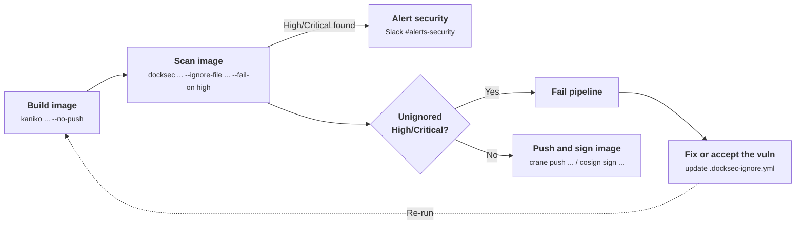
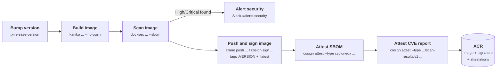
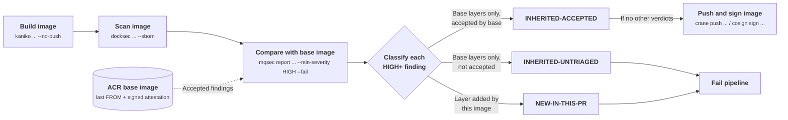

# Dockerfiles
Top-level container images used by MQube services.

## Adding a new container image
Say you want to add a new csharp image called `net-10`:
1. Create a folder within `dockerfiles/<category>/`, where the category best-describes the language or purpose of the image. The name of this sub-folder
will become the name of the generated image. Our `net-10` image would be created in `dockerfiles/csharp/net-10/`.
2. Regenerate the PR and release triggers in `.lighthouse/jenkins-x/triggers.yaml`:
```bash
./scripts/generate-triggers.sh
```
The `lint-pipelines` check fails if `triggers.yaml` is out of date, so don't edit it by hand.
3. (Optional) install `docksec` and `trivy` on your local machine, then run this script to add a `.docksec-ignore.yml` file to the new image folder:
```bash
./scripts/create-ignores.sh dockerfiles/csharp/net-10
```
This saves needing to get the results from the pipeline
4. Create a PR. The pipeline should run and build the new image

## Image Publication Diagrams

### PR pipeline (`dockerfile-pr.yaml`)
Gates the build: any High/Critical finding not listed in the image's `.docksec-ignore.yml` fails the PR.



### Release pipeline (`dockerfile-release.yaml`)
Runs on merge to `main`. Scans without the ignore file and attaches the full CVE report and SBOM to the image as signed attestations.



### Downstream service pipeline (`build-scan-push-mqsec.yaml`)
**Note: At time of writing, this has not yet been implemented....**

Services built on one of these images use the `build-scan-push` task from `mqube-pipeline-catalog`. `mqsec report` checks each finding against the base image's signed attestation, so a service is only blocked by findings it introduced or that nobody has accepted.



